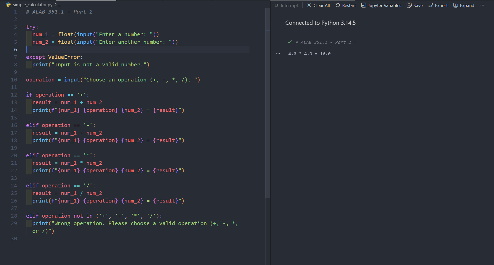
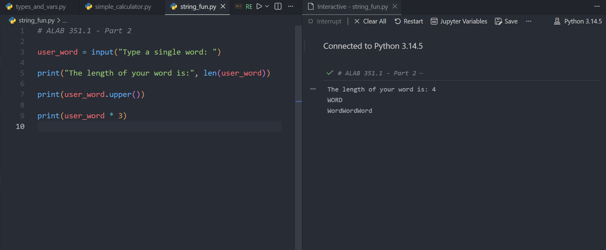
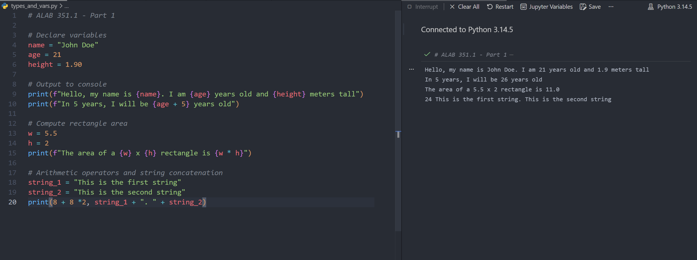

# Lab 2: Data Types, Variables, Operators, and Basic I/O

## Overview and Objectives

This lab focuses on fundamental Python concepts: data types, variables, operators, and input/output operations. You will write small programs that demonstrate using literals, performing calculations with operators, storing values in variables, and interacting with the user via input and output. By completing these tasks, you will be able to:

- Differentiate between different data types (integer, float, string, etc.) and use them in Python.
- Perform arithmetic and concatenation operations with Python operators.
- Declare and use variables to store data.
- Write programs that interact with the user through input (`input()`) and output (`print()`).
- Use comments to document your code.

## Instructions and Tasks

### Part 1: Python Basics and Output

Write a Python script `types_and_vars.py` that does the following:

1. Declares a variable `name` and assigns it your name as a string.
2. Declares a variable `age` and assigns it your age as an integer.
3. Declares a variable `height` and assigns it a floating-point number representing your height in meters.
4. Prints a sentence introducing yourself, for example: `"Hello, my name is Alice. I am 20 years old and 1.65 meters tall."`

Make sure to use the variables in the print statement (use f-string or string concatenation) instead of hardcoding the values. Run the script to ensure it outputs the correct sentence.

Modify the script to perform some simple calculations and demonstrate different operators:

- After the introduction sentence, add code that calculates what your age will be in 5 years and print a sentence stating that. For example: `"In 5 years, I will be 25 years old."`
- Calculate the area of a rectangle with width = 5.5 and height = 2 (you can hardcode these numbers or store them in variables). Print the result in a formatted sentence: `"The area of a 5.5 x 2 rectangle is 11.0."`
- Demonstrate the use of at least two different arithmetic operators (e.g., `+`, `-`, `*`, `/`, `//`, or `%`) and one string concatenation or repetition (e.g., using `+` to join strings or `*` to repeat a string).

Include comments in your code to explain what each section is doing. For example, comment the section where you calculate the age in 5 years and the section where you compute the rectangle area.

### Part 2: User Interaction and Input

Write a Python script `simple_calculator.py` that:

1. Asks the user to input two numbers (use two separate `input()` calls). Make sure to convert these inputs from strings to integers or floats as needed.
2. Asks the user to choose an operation (e.g., addition, subtraction, multiplication, division). This can be a simple prompt like `"Choose an operation (+, -, *, /): "`.
3. Performs the chosen operation on the two numbers.
4. Prints the result in a user-friendly way. For example: `"7 * 3 = 21"` (assuming the user chose `7`, `3`, and `*`).

Ensure the program can handle basic invalid inputs gracefully. For instance, if the user enters a non-numeric value for the numbers or an unsupported operation symbol, print an error message. (Tip: You can use an `if-elif-else` structure to check the operation and a simple `if` to validate numeric input using `isdigit()` or exception handling which will be covered later. For now, focus on the structure and assume valid input for simplicity if exception handling is not yet learned.)

Create a script `string_fun.py` that:

- Prompts the user for a word.
- Prints the length of the word.
- Prints the word in all uppercase.
- Prints the word repeated 3 times (on the same line or separate lines).

This task will help practice string operations and is optional for additional practice.

## Submission

Submit your Python scripts for each task: `types_and_vars.py`, `simple_calculator.py`, and `string_fun.py` via a link to a single GitHub repository containing all the files.

Also, include example outputs from running each script (you can copy from the console or take a screenshot and transcribe it) in a README file.

### Simple Calculator Example Output

### String Fun Example Output

### Types and Variables Example Output

